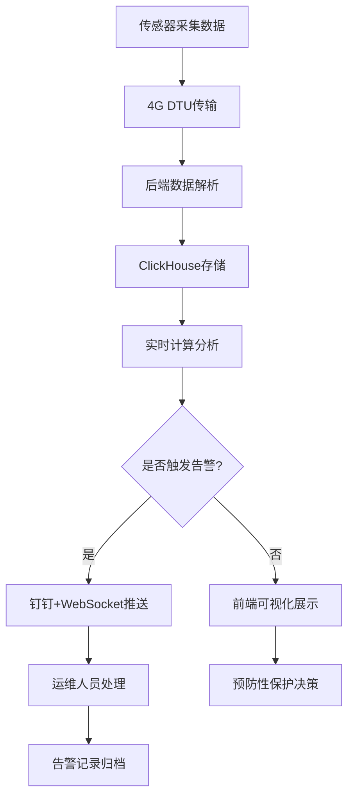

## 1. 产品概述

古代墓葬壁画盐害监测与预防性保护系统，针对唐代墓葬（懿德太子墓、永泰公主墓等）壁画的盐害风化问题，通过物联网传感器实时监测可溶性盐离子和微环境数据，结合盐分运移模型和结晶压力预测算法，实现盐害预警与预防性保护决策支持。

- **核心目标**：实时监测墓葬内40台盐离子传感器和30台微环境传感器数据，通过科学模型预测盐害发展趋势，及时告警并指导文物保护工作
- **目标用户**：考古工作者、文物保护专家、博物馆运维人员
- **市场价值**：填补国内墓葬壁画盐害智能化监测空白，为文化遗产预防性保护提供技术支撑

## 2. 核心功能

### 2.1 用户角色
| 角色 | 注册方式 | 核心权限 |
|------|----------|----------|
| 管理员 | 系统授权 | 完整权限，包括用户管理、设备配置、系统设置 |
| 文物保护专家 | 管理员分配 | 查看监测数据、分析报告、告警处理 |
| 运维人员 | 管理员分配 | 查看设备状态、处理告警、数据导出 |

### 2.2 功能模块
1. **3D墓室可视化**：Three.js渲染墓室三维结构，Canvas叠加盐害区域结晶纹理和生长方向动画
2. **实时数据监测**：展示盐离子浓度（Na⁺、Ca²⁺、SO₄²⁻、Cl⁻）和微环境数据（温湿度、风速）
3. **盐害分析预测**：盐分运移模型模拟、盐结晶压力预测、盐害发展趋势可视化
4. **告警管理**：多阈值告警触发、钉钉推送、WebSocket实时推送、告警历史查询
5. **设备管理**：70台传感器（40台盐离子+30台微环境）状态监控、数据上报配置
6. **数据查询与导出**：历史数据查询、多维度统计分析、报表导出

### 2.3 页面详情
| 页面名称 | 模块名称 | 功能描述 |
|----------|----------|-------------|
| 首页总览 | 3D墓室展示 | 墓室三维结构漫游、盐害区域热图、结晶动画展示 |
| 首页总览 | 关键指标卡片 | 盐分总量、相对湿度、告警数量、设备在线率 |
| 实时监测 | 盐离子监测 | Na⁺、Ca²⁺、SO₄²⁻、Cl⁻四种离子实时浓度曲线 |
| 实时监测 | 微环境监测 | 温度、湿度、风速实时数据展示 |
| 盐害分析 | 盐分运移模拟 | 基于Darcy定律和离子扩散方程的运移模型可视化 |
| 盐害分析 | 结晶压力预测 | Na₂SO₄相变热力学平衡计算结果展示 |
| 告警中心 | 告警列表 | 实时告警推送、告警级别、处理状态 |
| 告警中心 | 告警配置 | 阈值设置（盐分>5mg/cm²、湿度>75%持续48h）、通知渠道 |
| 设备管理 | 设备列表 | 40台盐离子传感器、30台微环境传感器状态监控 |
| 数据中心 | 历史查询 | 按时间范围、设备、指标维度查询历史数据 |
| 数据中心 | 统计报表 | 多维度统计分析、图表展示、Excel/PDF导出 |

## 3. 核心流程

**数据采集流程**：传感器每2小时采集一次数据 → 4G DTU传输数据 → 后端数据解析入库 → ClickHouse存储 → 实时计算分析 → 前端展示

**告警触发流程**：数据接入 → 阈值检测（盐分总量>5mg/cm² 或 相对湿度>75%持续48h）→ 触发告警 → 钉钉+WebSocket推送 → 运维人员处理 → 告警记录归档

## 4. 用户界面设计

### 4.1 设计风格
- **主色调**：深赭石色 #8B4513（代表文物历史厚重感）+ 青铜绿 #4A7C59（代表文物保护）
- **辅助色**：警示红 #D64545、警告黄 #E8A838、正常绿 #52B788
- **字体**：标题用"Noto Serif SC"宋体（庄重典雅），正文用"Noto Sans SC"（清晰易读）
- **布局风格**：深色科技风，左侧导航栏+主内容区，卡片式布局，玻璃拟态效果
- **动画风格**：盐结晶生长用粒子动画，告警用脉冲动画，数据加载用骨架屏

### 4.2 页面设计概述
| 页面名称 | 模块名称 | UI元素 |
|----------|----------|--------|
| 首页总览 | 3D墓室展示 | Three.js场景、轨道控制器、盐害热图、结晶纹理Shader、箭头动画 |
| 首页总览 | 指标卡片 | 渐变背景、实时数值、趋势箭头、微动画 |
| 实时监测 | 数据图表 | ECharts折线图、多Y轴展示、实时数据点 |
| 盐害分析 | 模型可视化 | Canvas绘制运移矢量场、压力云图、时间轴控制 |
| 告警中心 | 告警列表 | 级别颜色标识、闪烁动画、处理按钮 |
| 设备管理 | 设备拓扑 | 墓室平面布局图、设备位置标注、状态颜色标识 |

### 4.3 响应性
- 桌面端优先设计（1920×1080），自适应1280px以上屏幕
- 3D场景自适应容器大小，移动端自动简化模型
- 触控操作优化：双指缩放3D场景，点击查看设备详情

### 4.4 3D场景指导
- **环境氛围**：模拟墓葬内昏暗环境，柔和的暖色调点光源模拟考古工作灯
- **光照设置**：环境光+方向光+墓室壁面反射光，避免过强阴影
- **相机设置**：PerspectiveCamera，初始视角为墓室入口俯视，支持轨道漫游
- **交互方式**：鼠标拖拽旋转、滚轮缩放、双击聚焦到盐害区域
- **动画效果**：盐害区域用白色半透明结晶纹理随时间生长，箭头动画指示盐分运移方向
- **后处理**：Bloom效果突出盐害区域，轻微雾化模拟墓室空气感
- **性能优化**：LOD模型，实例化渲染大量传感器标记，目标帧率60fps
