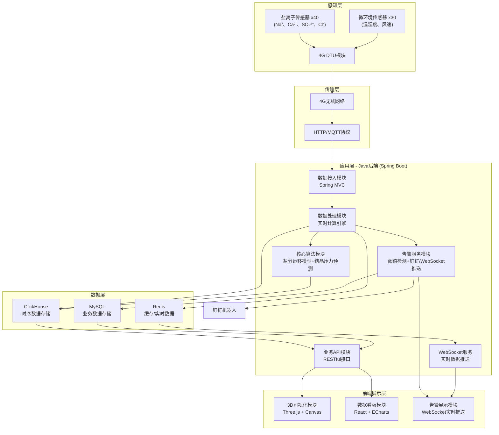
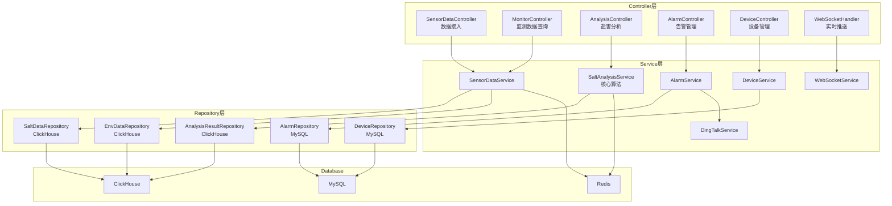

## 1. 架构设计



## 2. 技术描述

- **前端**：React@18 + TypeScript + Vite + TailwindCSS@3 + Three.js@0.160 + ECharts@5 + Zustand
- **后端**：Java 17 + Spring Boot 3.2 + Spring Data JPA + Spring WebSocket + ClickHouse JDBC
- **数据库**：ClickHouse 24.3（时序数据）+ MySQL 8.0（业务数据）+ Redis 7.0（缓存）
- **核心算法**：盐分运移模型（Darcy定律+离子扩散方程）、Na₂SO₄结晶压力预测（热力学平衡计算）
- **数据传输**：4G DTU HTTP上报 + WebSocket实时推送 + 钉钉机器人告警

## 3. 前端路由定义
| 路由 | 页面 | 说明 |
|------|------|------|
| / | 首页总览 | 3D墓室可视化、关键指标、实时告警 |
| /monitor | 实时监测 | 盐离子浓度、微环境数据实时展示 |
| /analysis | 盐害分析 | 盐分运移模拟、结晶压力预测 |
| /alarm | 告警中心 | 告警列表、告警配置、告警历史 |
| /device | 设备管理 | 传感器设备列表、状态监控 |
| /data | 数据中心 | 历史数据查询、统计报表、数据导出 |

## 4. API 定义

### 4.1 数据接入API
```typescript
// 传感器数据上报
interface SensorDataRequest {
  deviceId: string;
  deviceType: 'SALT' | 'ENV';
  timestamp: number;
  data: {
    naPlus?: number;      // Na⁺浓度 mg/cm²
    ca2Plus?: number;     // Ca²⁺浓度 mg/cm²
    so42Minus?: number;   // SO₄²⁻浓度 mg/cm²
    clMinus?: number;     // Cl⁻浓度 mg/cm²
    temperature?: number; // 温度 ℃
    humidity?: number;    // 相对湿度 %
    windSpeed?: number;   // 风速 m/s
  };
  location: {
    tombId: string;
    chamberId: string;
    position: { x: number; y: number; z: number };
  };
}

interface SensorDataResponse {
  success: boolean;
  message: string;
  dataId: string;
}
```

### 4.2 业务查询API
```typescript
// 查询盐离子数据
interface SaltDataQuery {
  tombId?: string;
  deviceId?: string;
  startTime: number;
  endTime: number;
  aggregation?: 'RAW' | 'HOUR' | 'DAY';
}

interface SaltDataVO {
  timestamp: number;
  deviceId: string;
  naPlus: number;
  ca2Plus: number;
  so42Minus: number;
  clMinus: number;
  totalSalt: number;
}

// 查询微环境数据
interface EnvDataQuery {
  tombId?: string;
  deviceId?: string;
  startTime: number;
  endTime: number;
  aggregation?: 'RAW' | 'HOUR' | 'DAY';
}

interface EnvDataVO {
  timestamp: number;
  deviceId: string;
  temperature: number;
  humidity: number;
  windSpeed: number;
}

// 盐害分析结果
interface SaltAnalysisVO {
  timestamp: number;
  location: { x: number; y: number; z: number };
  migrationVelocity: { x: number; y: number; z: number }; // 运移速度
  crystallizationPressure: number; // 结晶压力 MPa
  riskLevel: 'LOW' | 'MEDIUM' | 'HIGH' | 'CRITICAL';
  predictionHours: number; // 预测小时数
}

// 告警信息
interface AlarmVO {
  id: string;
  type: 'SALT_EXCEED' | 'HUMIDITY_EXCEED' | 'DEVICE_OFFLINE';
  level: 'WARNING' | 'ERROR' | 'CRITICAL';
  message: string;
  deviceId: string;
  tombId: string;
  timestamp: number;
  status: 'PENDING' | 'PROCESSING' | 'RESOLVED';
  value: number;
  threshold: number;
}
```

## 5. 后端架构图



## 6. 数据模型

### 6.1 ER图
```mermaid
erDiagram
    TOMB ||--o{ CHAMBER : contains
    TOMB ||--o{ DEVICE : has
    CHAMBER ||--o{ DEVICE : located_in
    DEVICE ||--o{ SALT_DATA : produces
    DEVICE ||--o{ ENV_DATA : produces
    DEVICE ||--o{ ALARM : triggers
    SALT_DATA ||--o{ ANALYSIS_RESULT : generates

    TOMB {
        String id PK
        String name
        String description
        BigDecimal longitude
        BigDecimal latitude
        DateTime createTime
    }

    CHAMBER {
        String id PK
        String tombId FK
        String name
        String description
        String structure
    }

    DEVICE {
        String id PK
        String tombId FK
        String chamberId FK
        String type
        String status
        String model
        DateTime installTime
        DateTime lastOnlineTime
        Double positionX
        Double positionY
        Double positionZ
    }

    SALT_DATA {
        DateTime timestamp PK
        String deviceId FK PK
        Double naPlus
        Double ca2Plus
        Double so42Minus
        Double clMinus
        Double totalSalt
    }

    ENV_DATA {
        DateTime timestamp PK
        String deviceId FK PK
        Double temperature
        Double humidity
        Double windSpeed
    }

    ALARM {
        String id PK
        String type
        String level
        String message
        String deviceId FK
        String tombId FK
        DateTime timestamp
        String status
        Double value
        Double threshold
    }

    ANALYSIS_RESULT {
        DateTime timestamp PK
        String deviceId FK PK
        Double velocityX
        Double velocityY
        Double velocityZ
        Double crystallizationPressure
        String riskLevel
        Integer predictionHours
    }
```

### 6.2 ClickHouse DDL
```sql
-- 盐离子数据表（MergeTree引擎，按天分区）
CREATE TABLE IF NOT EXISTS salt_damage.salt_data (
    `timestamp` DateTime64(3) COMMENT '采集时间',
    `device_id` String COMMENT '设备ID',
    `tomb_id` String COMMENT '墓葬ID',
    `chamber_id` String COMMENT '墓室ID',
    `na_plus` Float64 COMMENT 'Na⁺浓度 mg/cm²',
    `ca2_plus` Float64 COMMENT 'Ca²⁺浓度 mg/cm²',
    `so42_minus` Float64 COMMENT 'SO₄²⁻浓度 mg/cm²',
    `cl_minus` Float64 COMMENT 'Cl⁻浓度 mg/cm²',
    `total_salt` Float64 COMMENT '盐分总量 mg/cm²',
    `position_x` Float64 COMMENT 'X坐标',
    `position_y` Float64 COMMENT 'Y坐标',
    `position_z` Float64 COMMENT 'Z坐标'
) ENGINE = MergeTree()
PARTITION BY toYYYYMMDD(timestamp)
ORDER BY (tomb_id, device_id, timestamp)
TTL timestamp + INTERVAL 5 YEAR
COMMENT '盐离子监测数据表';

-- 微环境数据表
CREATE TABLE IF NOT EXISTS salt_damage.env_data (
    `timestamp` DateTime64(3) COMMENT '采集时间',
    `device_id` String COMMENT '设备ID',
    `tomb_id` String COMMENT '墓葬ID',
    `chamber_id` String COMMENT '墓室ID',
    `temperature` Float64 COMMENT '温度 ℃',
    `humidity` Float64 COMMENT '相对湿度 %',
    `wind_speed` Float64 COMMENT '风速 m/s',
    `position_x` Float64 COMMENT 'X坐标',
    `position_y` Float64 COMMENT 'Y坐标',
    `position_z` Float64 COMMENT 'Z坐标'
) ENGINE = MergeTree()
PARTITION BY toYYYYMMDD(timestamp)
ORDER BY (tomb_id, device_id, timestamp)
TTL timestamp + INTERVAL 5 YEAR
COMMENT '微环境监测数据表';

-- 分析结果表
CREATE TABLE IF NOT EXISTS salt_damage.analysis_result (
    `timestamp` DateTime64(3) COMMENT '分析时间',
    `device_id` String COMMENT '设备ID',
    `tomb_id` String COMMENT '墓葬ID',
    `chamber_id` String COMMENT '墓室ID',
    `velocity_x` Float64 COMMENT '运移速度X分量',
    `velocity_y` Float64 COMMENT '运移速度Y分量',
    `velocity_z` Float64 COMMENT '运移速度Z分量',
    `crystallization_pressure` Float64 COMMENT '结晶压力 MPa',
    `risk_level` String COMMENT '风险等级',
    `prediction_hours` Int32 COMMENT '预测小时数',
    `position_x` Float64 COMMENT 'X坐标',
    `position_y` Float64 COMMENT 'Y坐标',
    `position_z` Float64 COMMENT 'Z坐标'
) ENGINE = MergeTree()
PARTITION BY toYYYYMMDD(timestamp)
ORDER BY (tomb_id, device_id, timestamp)
COMMENT '盐害分析结果表';

-- 告警历史表
CREATE TABLE IF NOT EXISTS salt_damage.alarm_history (
    `id` String COMMENT '告警ID',
    `type` String COMMENT '告警类型',
    `level` String COMMENT '告警级别',
    `message` String COMMENT '告警消息',
    `device_id` String COMMENT '设备ID',
    `tomb_id` String COMMENT '墓葬ID',
    `timestamp` DateTime64(3) COMMENT '告警时间',
    `status` String COMMENT '处理状态',
    `value` Float64 COMMENT '实际值',
    `threshold` Float64 COMMENT '阈值',
    `process_user` String COMMENT '处理人',
    `process_time` DateTime64(3) COMMENT '处理时间',
    `process_note` String COMMENT '处理备注'
) ENGINE = MergeTree()
PARTITION BY toYYYYMM(timestamp)
ORDER BY (tomb_id, timestamp)
COMMENT '告警历史表';

-- 分布式表（如果是集群部署）
-- CREATE TABLE IF NOT EXISTS salt_damage.salt_data_all ON CLUSTER cluster1
-- AS salt_damage.salt_data ENGINE = Distributed(cluster1, salt_damage, salt_data, rand());
```

### 6.3 MySQL DDL
```sql
-- 墓葬表
CREATE TABLE tomb (
    id VARCHAR(32) PRIMARY KEY COMMENT '主键',
    name VARCHAR(100) NOT NULL COMMENT '墓葬名称',
    code VARCHAR(50) UNIQUE NOT NULL COMMENT '墓葬编码',
    dynasty VARCHAR(50) COMMENT '朝代',
    description TEXT COMMENT '描述',
    longitude DECIMAL(10,6) COMMENT '经度',
    latitude DECIMAL(10,6) COMMENT '纬度',
    address VARCHAR(255) COMMENT '地址',
    create_time DATETIME DEFAULT CURRENT_TIMESTAMP COMMENT '创建时间',
    update_time DATETIME DEFAULT CURRENT_TIMESTAMP ON UPDATE CURRENT_TIMESTAMP COMMENT '更新时间'
) ENGINE=InnoDB DEFAULT CHARSET=utf8mb4 COMMENT='墓葬信息表';

-- 墓室表
CREATE TABLE chamber (
    id VARCHAR(32) PRIMARY KEY COMMENT '主键',
    tomb_id VARCHAR(32) NOT NULL COMMENT '墓葬ID',
    name VARCHAR(100) NOT NULL COMMENT '墓室名称',
    code VARCHAR(50) NOT NULL COMMENT '墓室编码',
    description TEXT COMMENT '描述',
    structure_info JSON COMMENT '结构信息',
    UNIQUE KEY uk_tomb_code (tomb_id, code),
    FOREIGN KEY (tomb_id) REFERENCES tomb(id)
) ENGINE=InnoDB DEFAULT CHARSET=utf8mb4 COMMENT='墓室信息表';

-- 设备表
CREATE TABLE device (
    id VARCHAR(32) PRIMARY KEY COMMENT '主键',
    tomb_id VARCHAR(32) NOT NULL COMMENT '墓葬ID',
    chamber_id VARCHAR(32) COMMENT '墓室ID',
    code VARCHAR(50) UNIQUE NOT NULL COMMENT '设备编码',
    name VARCHAR(100) NOT NULL COMMENT '设备名称',
    type VARCHAR(20) NOT NULL COMMENT '设备类型: SALT-盐离子, ENV-微环境',
    model VARCHAR(50) COMMENT '设备型号',
    status VARCHAR(20) DEFAULT 'ONLINE' COMMENT '状态: ONLINE-在线, OFFLINE-离线, MAINTENANCE-维护',
    position_x DECIMAL(10,3) COMMENT 'X坐标',
    position_y DECIMAL(10,3) COMMENT 'Y坐标',
    position_z DECIMAL(10,3) COMMENT 'Z坐标',
    install_time DATETIME COMMENT '安装时间',
    last_online_time DATETIME COMMENT '最后在线时间',
    create_time DATETIME DEFAULT CURRENT_TIMESTAMP COMMENT '创建时间',
    update_time DATETIME DEFAULT CURRENT_TIMESTAMP ON UPDATE CURRENT_TIMESTAMP COMMENT '更新时间',
    FOREIGN KEY (tomb_id) REFERENCES tomb(id),
    FOREIGN KEY (chamber_id) REFERENCES chamber(id)
) ENGINE=InnoDB DEFAULT CHARSET=utf8mb4 COMMENT='设备信息表';

-- 告警配置表
CREATE TABLE alarm_config (
    id VARCHAR(32) PRIMARY KEY COMMENT '主键',
    tomb_id VARCHAR(32) COMMENT '墓葬ID',
    type VARCHAR(50) NOT NULL COMMENT '告警类型',
    threshold_value DECIMAL(10,3) NOT NULL COMMENT '阈值',
    duration_hours INT DEFAULT 0 COMMENT '持续时间(小时)',
    level VARCHAR(20) NOT NULL COMMENT '告警级别',
    enabled TINYINT DEFAULT 1 COMMENT '是否启用',
    create_time DATETIME DEFAULT CURRENT_TIMESTAMP COMMENT '创建时间',
    FOREIGN KEY (tomb_id) REFERENCES tomb(id)
) ENGINE=InnoDB DEFAULT CHARSET=utf8mb4 COMMENT='告警配置表';

-- 初始化数据
INSERT INTO tomb (id, name, code, dynasty, description) VALUES
('T001', '懿德太子墓', 'YDTZ', '唐代', '懿德太子李重润墓，乾陵陪葬墓之一'),
('T002', '永泰公主墓', 'YTGZ', '唐代', '永泰公主李仙蕙墓，乾陵陪葬墓之一');

INSERT INTO chamber (id, tomb_id, name, code) VALUES
('C001', 'T001', '墓道', 'YD-MD'),
('C002', 'T001', '前室', 'YD-QS'),
('C003', 'T001', '后室', 'YD-HS'),
('C004', 'T002', '墓道', 'YT-MD'),
('C005', 'T002', '前室', 'YT-QS'),
('C006', 'T002', '后室', 'YT-HS');

-- 告警配置
INSERT INTO alarm_config (id, type, threshold_value, duration_hours, level) VALUES
('AC001', 'SALT_EXCEED', 5.0, 0, 'CRITICAL'),
('AC002', 'HUMIDITY_EXCEED', 75.0, 48, 'WARNING');
```

## 7. 核心算法说明

### 7.1 盐分运移模型（Darcy定律 + 离子扩散方程）

```java
/**
 * 盐分运移模型
 * 基于Darcy定律描述孔隙水流，结合Fick定律描述离子扩散
 */
public class SaltMigrationModel {
    
    /**
     * 计算盐分运移速度
     * v = -k/μ * ∇P + D * ∇C
     * 其中:
     * - k/μ * ∇P: Darcy流速项 (孔隙水压力梯度驱动)
     * - D * ∇C: 扩散项 (浓度梯度驱动)
     */
    public Vector3D calculateMigrationVelocity(double[][] concentrationGrid, 
                                                double[][] pressureGrid,
                                                double porosity, double permeability,
                                                double viscosity, double diffusionCoeff,
                                                int x, int y, double deltaX, double deltaY) {
        // 计算浓度梯度 (Fick定律)
        double dCdx = (concentrationGrid[x+1][y] - concentrationGrid[x-1][y]) / (2 * deltaX);
        double dCdy = (concentrationGrid[x][y+1] - concentrationGrid[x][y-1]) / (2 * deltaY);
        
        // 计算压力梯度 (Darcy定律)
        double dPdx = (pressureGrid[x+1][y] - pressureGrid[x-1][y]) / (2 * deltaX);
        double dPdy = (pressureGrid[x][y+1] - pressureGrid[x][y-1]) / (2 * deltaY);
        
        // 计算达西流速
        double k_mu = permeability / viscosity;
        double vx_darcy = -k_mu * dPdx;
        double vy_darcy = -k_mu * dPdy;
        
        // 计算扩散速度
        double vx_diffusion = diffusionCoeff * dCdx;
        double vy_diffusion = diffusionCoeff * dCdy;
        
        // 孔隙度修正
        double effectivePorosity = Math.pow(porosity, 1.5); // Kozeny-Carman修正
        
        return new Vector3D(
            (vx_darcy + vx_diffusion) / effectivePorosity,
            (vy_darcy + vy_diffusion) / effectivePorosity,
            0.0
        );
    }
}
```

### 7.2 盐结晶压力预测（Na₂SO₄相变热力学平衡）

```java
/**
 * Na₂SO₄结晶压力预测模型
 * 基于热力学平衡计算十水硫酸钠(Na₂SO₄·10H₂O)的结晶压力
 */
public class CrystallizationPressureModel {
    
    private static final double R = 8.314;      // 气体常数 J/(mol·K)
    private static final double T0 = 298.15;    // 参考温度 K
    private static final double Vm = 0.000292;  // 十水硫酸钠摩尔体积 m³/mol
    
    /**
     * 计算结晶压力
     * ΔP = (RT/Vm) * ln(a/a0) + ΔHf * (1/T0 - 1/T) * Vm
     * 其中:
     * - a: 当前溶液活度
     * - a0: 平衡活度
     * - ΔHf: 溶解焓
     */
    public double calculateCrystallizationPressure(double concentration, 
                                                   double temperature,
                                                   double relativeHumidity) {
        double T = temperature + 273.15;
        
        // 计算Na₂SO₄活度 (基于Pitzer方程简化)
        double ionicStrength = 3 * concentration; // I = 1/2 * Σ(mi * zi²)
        double activityCoefficient = calculateActivityCoefficient(ionicStrength, T);
        double a = activityCoefficient * concentration;
        
        // 计算平衡活度 (考虑相对湿度影响)
        double a0 = calculateEquilibriumActivity(T, relativeHumidity);
        
        // 溶解焓 (Na₂SO₄·10H₂O → Na₂SO₄ + 10H₂O)
        double deltaHf = 78000; // J/mol (十水硫酸钠溶解焓)
        
        // 计算结晶压力
        double lnRatio = Math.log(Math.max(a / a0, 1e-10));
        double pressureIdeal = (R * T / Vm) * lnRatio;
        
        // 温度修正项
        double tempCorrection = deltaHf * (1.0 / T0 - 1.0 / T) / Vm;
        
        // 相对湿度修正 (湿度越低，结晶压力越大)
        double rhCorrection = 1.0 + (1.0 - relativeHumidity) * 0.5;
        
        double totalPressure = (pressureIdeal + tempCorrection) * rhCorrection;
        
        // 转换为 MPa (Pa → MPa)
        return Math.max(totalPressure / 1e6, 0);
    }
    
    /**
     * 使用简化的Pitzer方程计算活度系数
     */
    private double calculateActivityCoefficient(double ionicStrength, double T) {
        double A = 0.491 + (T - 298.15) * 0.0009; // Debye-Hückel常数
        double beta0 = 0.0496;
        double beta1 = 1.035;
        double Cphi = 0.0083;
        
        double alpha = 2.0;
        double b = 1.2;
        
        double sqrtI = Math.sqrt(ionicStrength);
        double term = beta1 * Math.exp(-alpha * sqrtI);
        
        double lnGamma = 2 * (-A * sqrtI / (1 + b * sqrtI) + 
                              beta0 * ionicStrength + 
                              term * ionicStrength + 
                              2 * Cphi * ionicStrength * sqrtI / 3);
        
        return Math.exp(lnGamma);
    }
    
    /**
     * 计算平衡活度 (基于温度和相对湿度)
     */
    private double calculateEquilibriumActivity(double T, double RH) {
        // Na₂SO₄·10H₂O的平衡溶解度随温度变化
        double solubility = 0.35 + (T - 273.15) * 0.005; // mol/kg (0°C时约0.35mol/kg)
        
        // 考虑相对湿度的影响 (湿度影响水活度)
        double waterActivity = RH;
        
        // 十水合物的平衡条件: a(Na₂SO₄) * a(H2O)^10 = Ksp
        double Ksp = Math.pow(0.22, 3) * Math.pow(0.38, 10); // 经验溶度积
        
        return Ksp / Math.pow(waterActivity, 10);
    }
}
```
